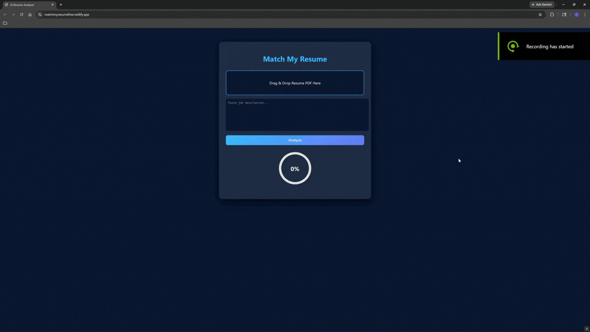

# AI Resume Analyzer

A full-stack AI web application that analyzes resumes against job descriptions and provides ATS-style scoring, feedback, and improvement suggestions.

## 🌐 Live Demo
[matchmyresumefree.netlify.app/](https://matchmyresumefree.netlify.app/)

---

## 🚀 Features
- Upload resume (PDF)
- Match against job descriptions
- ATS-style scoring system
- Strengths, weaknesses, and improvement suggestions
- Interactive UI with real-time feedback

---

## 🛠 Tech Stack
- **Frontend:** HTML, CSS, JavaScript  
- **Backend:** FastAPI (Python)  
- **Deployment:** Netlify (Frontend), Render (Backend)

---

## ⚙️ How It Works
1. Upload your resume
2. Paste a job description
3. The system analyzes keyword matches
4. Generates a score and actionable feedback

---

## 🎥 Demo


---

## 📦 Installation (Local Setup)

### Backend
```bash
cd backend
pip install -r requirements.txt
uvicorn main:app --reload
```

### Frontend
```bash
cd frontend
open index.html
```

---

## 💡 Future Improvements
- Keyword highlighting in resumes
- Job link parsing (auto-fetch job description)
- Improved AI feedback using LLMs
- User authentication & saved results

---

## 👨‍💻 Author

**Chris Jung**   
Computer Science @ University of California, Riverside
